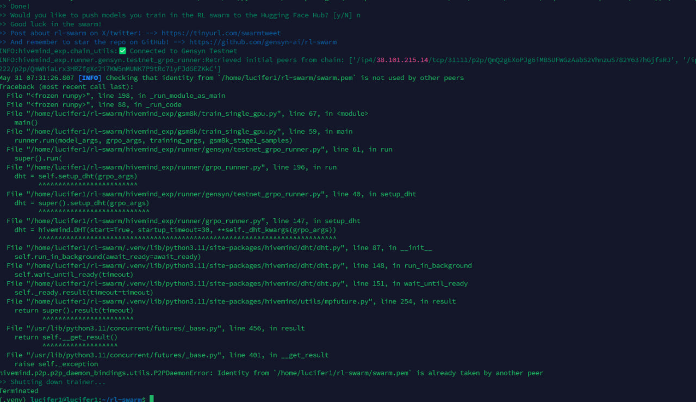

<h2 align="center">❓ FAQ & Troubleshooting</h2>


---

### 1. 🚫 Node Start and Stop Problem (Reset Gensyn Node)


> **⚠️ Must save your `swarm.pem` file before deleting the node.**  
> [📦 How to back it up? Click here.](https://github.com/HustleAirdrops/Gensyn-Advanced-Solutions/tree/main#-backup-credentials)

**Delete Old Gensyn:**
```bash
cd ~
sudo rm -rf ~/rl-swarm
```
**Reinstall Gensyn:**
```bash
git clone https://github.com/gensyn-ai/rl-swarm.git
cd rl-swarm
```
**Start Node:**
```bash
python3 -m venv .venv
source .venv/bin/activate
./run_rl_swarm.sh
```
✅ **You're now ready to go!**

---

### 2. 🛠️ BF16 / Login / DHTNode Bootstrap Error / Minor Errors

Run this one-liner to fix common issues:
```bash
bash -c "$(curl -fsSL https://raw.githubusercontent.com/hustleairdrops/Gensyn_Guide_with_all_solutions/main/solutions_file/fixall.sh)"
```

---

### 3. 🔁 Daemon & Bootstrap Error?

Just run your node **3–4 times** — it usually resolves itself! 🔄

---

### 4. 🆔 Identity is already taken by other peer



```bash
pkill -f swarm.pem
```
After running this command, start your node again — **it'll be fixed!**

---

### 5. 🟠 Downgrade RL-Swarm Version

If you face issues with the latest version, downgrade easily:

```bash
cd ~
bash -c "$(curl -fsSL https://raw.githubusercontent.com/HustleAirdrops/Gensyn_Guide_with_all_solutions/main/solutions_file/Downgrade.sh)"
```
Then start your node:
```bash
cd rl-swarm
python3 -m venv .venv
source .venv/bin/activate
./run_rl_swarm.sh
```
*(Tip: Use `screen` if you want to run in the background!)*

---

### 6. 🟩 RAM Issue


Add swap memory:
```bash
sudo fallocate -l 4G /swapfile
sudo chmod 600 /swapfile
sudo mkswap /swapfile
sudo swapon /swapfile
```
After this, run your node again!

---

### 7. 🌐 Cloudtunnel Not Opening

- Make sure your node is **running** at the same time you try to log in.
- Double-check your credentials and network connection.

---
